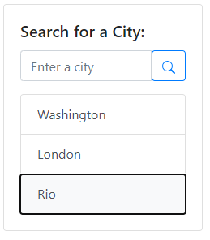
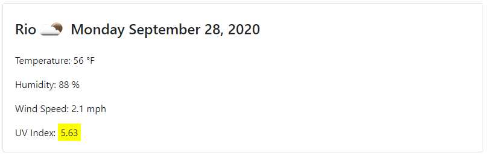
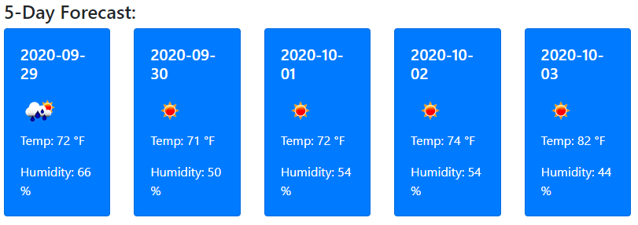
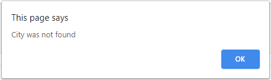

# Weather Dashboard


Link : [Project Link]( https://cesaraugustomartinez.github.io/Weather_Dashboard/)

---

### Table of Contents

- [Description](#description)
- [How to Use](#how-to-use)
- [Screenshots](#screenshots)
- [References](#references)
- [License](#license)
- [Author Info](#author-info)

---

## Description

The goal of this project is create a Weather Dashboard retrieving data from another application's API. This app will make requests with specific parameters to a URL. This app was builded using jQuery code to generate a dynamically HTML and CSS pages. 

##### Technologies

- Html
- jQuery
- Visual Studio Code
- Bootstrap
- Moment.js Library
- API

##### Code sample - JQuery
#
```js
$(document).ready(function(){
    $("#searchButton").on("click", function(){  // Adding click event listen listener to all buttons
        console.log(cities);
        if ($("#cityName").val() === ""){
            console.log($("#cityName").val());
            return;
        } else {
            if (jQuery.inArray($("#cityName").val(), cities) === -1){
                cities.push($("#cityName").val());
                console.log(cities);
                localStorage.setItem("Cities",JSON.stringify(cities));  // Grabbing and storing the name city from the button
                var newCity = $("<button type='button' class='list-group-item list-group-item-action'>"); 
                newCity.text($("#cityName").val());
                $("#listCities").prepend(newCity);
                clearForecast();
                apiCallOut($("#cityName").val());
            } else {
                clearForecast();
                apiCallOut($("#cityName").val()); 
            }
        }
        $("#listCities").empty();
        initStore();
        $("#listCities button").on("click", function(){  // Event listener for button, for when the button is clicked
            console.log($(this).text());
            clearForecast();
            apiCallOut($(this).text());           
        });            
        });
    
});

```
##### Code sample - AJAX to get data from the API
#
```js
 var apiKey = "2f83f2e43f057df57403be35ef7a51f5";
        var queryURL = "https://api.openweathermap.org/data/2.5/weather?q="+city+"&cnt=6&appid="+apiKey; // Constructing a queryURL using the city name and api key
        $.ajax({ // Performing an AJAX request with the queryURL
          url: queryURL,
          method: "GET"
        })
  
        // call back function, what to do with the response after asynchronous call is finished
          .then(function(response) {
              temp = ((parseInt(response.main.temp) - 273.15) * 9/5 + 32);
              humidity = response.main.humidity;
              windSpeed = response.wind.speed;
              lon = response.coord.lon;
              lat = response.coord.lat;
              iconCode = response.weather[0].icon;

```
---

## How To Use

This web application has a page index.html where the user can enter a name of a city, and then search the weather information by clicking the button search. Once It has clicked the name of the city will be stored and added to the search history. The user will have weather information of the current day and a 5 days forecast. It has information like the date, a icon resprestation of weather conditions, the temperature, the humidity, the wind speed, and UV index. If the user close the browser this app stores all the cities and when It opens the app it shows the last searched city forecast.

 
## Screenshots

- Search Card



- Current Weather Information 



- 5 Days Forecast



- Alert if the city was not found



[Back To The Top](#Weather-Dashboard)

---

## References

- w3school -- [jQuery Tutorial](https://www.w3schools.com/jquery/)
- Bootstrap -- [Build fast, responsive sites with Bootstrap](https://getbootstrap.com/)
- W3school -- [The HTML DOM Element Object](https://www.w3schools.com/jsref/dom_obj_all.asp)
- Moment Libary -- [Parse, validate, manipulate,
and display dates and times in JavaScript.](https://momentjs.com/)
- W3school -- [AJAX Introduction](https://www.w3schools.com/js/js_ajax_intro.asp)
- Open Weather API -- [Weather API](https://openweathermap.org/api)


[Back To The Top](#Weather-Dashboard)

---

## License

Copyright (c) [2020] [Cesar A Martinez]

[Back To The Top](#Weather-Dashboard)

---

## Author Info

- Twitter -- [@cesaguma](https://twitter.com/cesaguma)
- Linkedin -- [Cesar A Martinez](https://www.linkedin.com/in/cesar-augusto-martinez-auquilla-03934a16b/)

[Back To The Top](#Weather-Dashboard)
